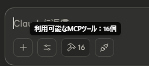
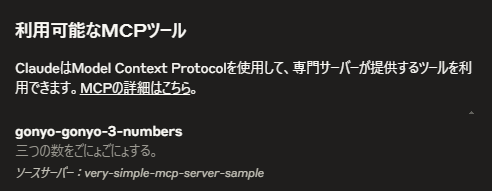
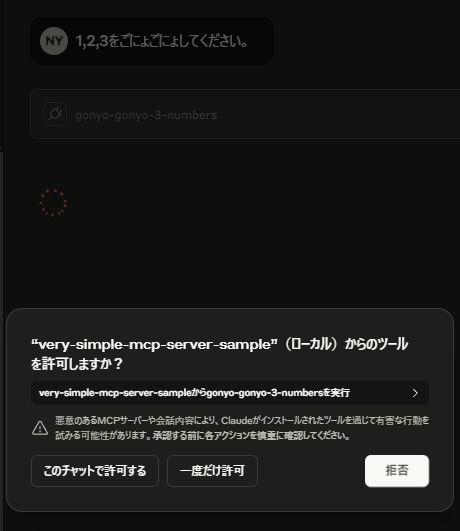
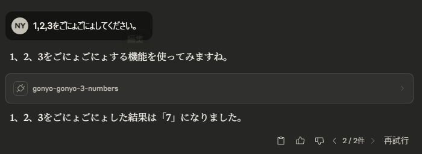

# very-simple-mcp-server-sample
(English follows)

おそらくは、世界で最もシンプルな MCP サーバーのサンプルです。コードは50行もありません。

以下の手順でビルドしてください。（node と npm はご自身でインストールしてください。node を入れると npm も入ります）

`npm install`

`npm run build`

上記が完了し、`build` フォルダができていれば成功です。このフォルダへのパスを `<PATH_TO_HERE>` とし、
例えば、Claude Desktop であれば、以下を claude_desktop_config.json に記述してください。（`mcpServers` の中に追加記述です）

```
{
  "mcpServers": {
    "very-simple-mcp-server-sample": {
      "command": "node",
      "args": [
        "<PATH_TO_HERE>/build/index.js"
      ]
    }
  }
}
```
「利用可能なMCPツール」



で、以下のように表示されれば設定完了です。



Claude Desktop で「1,2,3をごにょごにょしてください」などと頼むと、以下のようになりますので許可してください。



以下のようになれば成功です。




(Japanse above)

This is probably the simplest MCP server sample in the world. The code is less than 50 lines.

Please build it using the following steps. (You need to install Node.js and npm on your own. Installing Node.js will also install npm.)

`npm install`

`npm run build`

If the above steps complete successfully and a build folder is created, you’re good to go. Assume the path to this folder is <PATH_TO_HERE>.
For example, in Claude Desktop, add the following to your claude_desktop_config.json (as an entry inside mcpServers):

```
{
  "mcpServers": {
    "very-simple-mcp-server-sample": {
      "command": "node",
      "args": [
        "<PATH_TO_HERE>/build/index.js"
      ]
    }
  }
}
```
If it appears in “Available MCP Tools”


like this:


then the setup is complete.

When you ask Claude Desktop something like “Please do 1, 2, 3”, you’ll see a permission prompt like this—please allow it:


If you see something like this, it’s working:


